# Probabilistic Perspective Machine Learning ppml 
This repository contains code to replicate, modify the codes and prove the mathematical Machine Learning concepts from 
1. [probml/pmtk3](https://github.com/probml/pmtk3)
2. [Machine Learning A Probabilistic Perspective](https://doc.lagout.org/science/Artificial%20Intelligence/Machine%20learning/Machine%20Learning_%20A%20Probabilistic%20Perspective%20%5BMurphy%202012-08-24%5D.pdf).  

All the work is in the following format, 
- MATLAB implementation
- Python implementation with proofs and explanations

This repository is intended for people who want to learn more about Probabilistic Machine Learning alongside with simplified examples, and will cover different concepts, such as [Polynomial Regression](Probabilistic%20Machine%20Learning/Introduction%20to%20Probabilistic%20Machine%20Learning/Linear%20in%20the%20parameters%20regression.ipynb), [LU decomposition](Probabilistic%20Machine%20Learning/Introduction%20to%20Probabilistic%20Machine%20Learning/Linear%20in%20the%20parameters%20regression.ipynb), [Cholesky decomposition](Probabilistic%20Machine%20Learning/Introduction%20to%20Probabilistic%20Machine%20Learning/Linear%20in%20the%20parameters%20regression.ipynb), [Bayesian Inference for PolyReg](Probabilistic%20Machine%20Learning/Introduction%20to%20Probabilistic%20Machine%20Learning/Bayesian%20inference%20and%20prediction%20with%20finite%20regression%20models.ipynb), [Number Game Bayes](Machine%20Learning%20A%20Probabilistic%20Perspective/3GMDD/F3.2/3.2numberGame.ipynb), [Monte Carlo Sampling Pi](Machine%20Learning%20A%20Probabilistic%20Perspective/2Probability/F2.19/2.19mcEstimatePi.ipynb), [naive Bayes classifier](Machine%20Learning%20A%20Probabilistic%20Perspective/3GMDD/F3.8/3.8naiveBayesBowDemo.ipynb), [student distribution em algorithm](Machine%20Learning%20A%20Probabilistic%20Perspective/2Probability/F2.8/2.8RobustDemo.ipynb), [Principal Component Analysis](Machine%20Learning%20A%20Probabilistic%20Perspective/12LatentLinearModels/F12.5/12.5pcaImageDemo.ipynb), [Independent Component Analysis](Machine%20Learning%20A%20Probabilistic%20Perspective/12LatentLinearModels/F12.20/12.20icaDemo.ipynb), [Gibbs Sampling Ranking](Probabilistic%20Machine%20Learning/Ranking/Ranking.ipynb), [Message Passing Ranking](Probabilistic%20Machine%20Learning/Message%20Passing/Message%20Passing.ipynb), [Mixture of Multinomial Model](Probabilistic%20Machine%20Learning/Multinomial%20Mixture/Mixture%20of%20Multinomials.ipynb), [Latent Dirichlet Allocation](Probabilistic%20Machine%20Learning/Latent%20Dirichlet%20Allocation/Latent%20Dirichlet%20Allocation.ipynb), GMM EM, lasso, bayes net, etc.

Other works relevant to Deep Learning include, [Local Interpretable Model-Agnostic Explanations](LIME/LIME.ipynb), [Variational Autoencoder](Variational%20Autoencoder%20and%20Its%20extension/VAE/VAE.m), [Bata-VAE](Variational%20Autoencoder%20and%20Its%20extension/BVAE/BVAE.m), Neural Statistician, [Generative Adversarial Network](Generative%20Adversarial%20Network%20and%20its%20extension/GAN/GAN.m), [Deep Convolution GAN](Generative%20Adversarial%20Network%20and%20its%20extension/DCGAN/DCGAN.m), [Least-Squared GAN](Generative%20Adversarial%20Network%20and%20its%20extension/LSGAN/LSGAN.m), [Conditional-GAN (selfmade+Embedding+Dropout)](Generative%20Adversarial%20Network%20and%20its%20extension/CGAN/CGAN.m), [InfoGAN](Generative%20Adversarial%20Network%20and%20its%20extension/InfoGAN/InfoGAN.m), [Auxiliary Classifier GAN (one hot encoding)](Generative%20Adversarial%20Network%20and%20its%20extension/ACGAN/ACGAN.m), [CycleGAN](https://github.com/zcemycl/Matlab-GAN/blob/master/CycleGAN/CycleGAN.m), [Adverarsial Autoencoder](https://github.com/zcemycl/Matlab-GAN/blob/master/AAE/AAE.m), [Pix2Pix](https://github.com/zcemycl/Matlab-GAN/blob/master/Pix2Pix/PIX2PIX.m), DiscoGAN, Gaussian Dropout, Variational Dropout, Bayes by Backprop, etc.

Other works relevant to Robotics and Computer Vision include, [Solve ODE](Robotics/ODEsolver/Ordinary%20Differential%20Equation.ipynb), [Kinematic Control](Robotics/Kinematics/RoboticArm.m), [A* algorithm](Robotics/Astar/AstarAlgorithm.ipynb), [Dijkstra Algorithm](Robotics/DijkstraGrid/DijkstraAlgorithm.ipynb), [Potential Field Path Planning](Robotics/PotentialFieldPlanPath/PotentialFieldPath.ipynb), [ChessBoard Calibration](Computer%20Vision/Calibration/calibrationviaChessBoard.ipynb), [2D Homography](Computer%20Vision/Logo%20Projection/LogoProjection.ipynb), [KLT Optical Track](Computer%20Vision/Optical%20Track/CornerTracking.ipynb), [3D Homography (AR)](Computer%20Vision/3D%20object%20projection/3D%20Homography.ipynb), [Point Cloud](Computer%20Vision/Point%20Cloud/PointCloud.ipynb), [PD Control](Robotics/PDcontrol/PDTrack.ipynb), [Estimated Kalman Filter](Robotics/Estimated%20Kalman%20Filter/EKF.ipynb), [Mobile Inverted Pendulum](Robotics/MobileInvertedPendulum/MIP.ipynb), [LQR MIP](Robotics/LQRMIP/LQRMIP.ipynb), [PID MIP](Robotics/PIDMIP/PIDControlMIP.ipynb), [Configuration Space](Robotics/ConfigurationSpace/ConfigurationSpace.ipynb), [Quadcopter 1D](Robotics/Aerial%20Robotics/Quadcopter1D.ipynb), [Quadcopter 2D](Robotics/Aerial%20Robotics/Quadcopter2D.ipynb), [Occupancy Grid Map](Robotics/EstimationAndLearning/Week3/occGridMapping.ipynb), [Particle Localization](Robotics/EstimationAndLearning/Week4/ParticleLocalization.ipynb), etc.

Reinforcement Learning: [Value Iteration](ReinforcemnetLearning/ValueIteration.ipynb), [Policy Iteration](ReinforcemnetLearning/PolicyIteration.ipynb), [sarsa](ReinforcemnetLearning/sarsa.ipynb), [q-learning](ReinforcemnetLearning/q-learning.ipynb)

[TO DO SUMMARIZATION]: NLP, [Finite State Transducer](Others/Probabilistic%20Automata/WA.pdf), [Speech Processing](Others/Speech%20Processing/SP.pdf), [Recognition](Others/Speech%20Recognition/SR.pdf), [Synthesis](Others/Speech%20Synthesis/SS.pdf), [Machine Translation](Others/Machine%20Translation/MT.pdf) and [Attention Mechanism](Others/Attention%20Mechanism/main.m). 

 ## References
 - Murphy, Kevin P. 2012, Machine Learning: A Probabilistic Perspective, The MIT Press 0262018020, 9780262018029. 
 - Ribeiro, Marco Tulio et al. “"Why Should I Trust You?": Explaining the Predictions of Any Classifier.” HLT-NAACL Demos (2016).
 - Burgess, Christopher P. et al. “Understanding disentangling in $\beta$-VAE.” (2018).
 - Kingma, Diederik P. and Max Welling. “Auto-Encoding Variational Bayes.” CoRR abs/1312.6114 (2013): n. pag.
 - Loic Matthey and Irina Higgins and Demis Hassabis and Alexander Lerchner. "dSprites: Disentanglement testing Sprites dataset". https://github.com/deepmind/dsprites-dataset/. (2017).

 
 ## Results
LIME         |  ICA  | PCA|MC Pi estimation
:-------------------------:|:-------------------------:|:-------------------------:|:-------------------------:
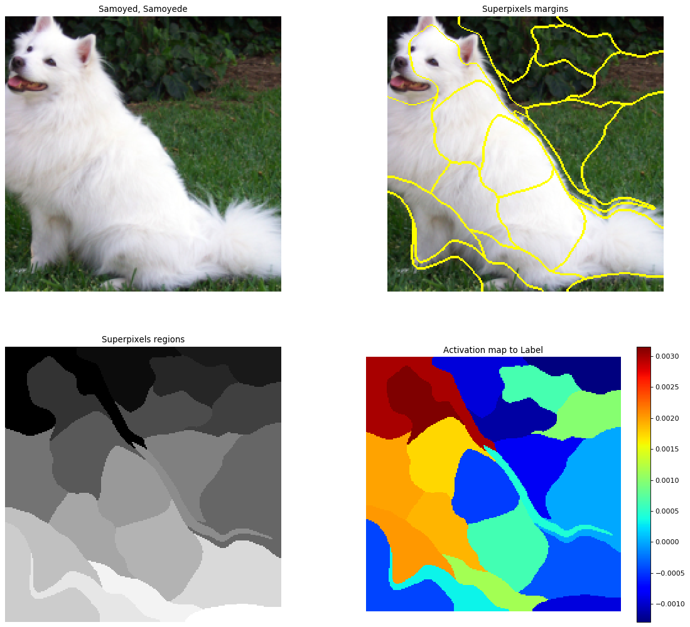 |  ||
Gaussian Blob dataset|VAE|GAN|DCGAN
|||
naive Bayes classifier| Robotic Arm (Kinematics) | Walking Robot (Kinematics) | Dijkstra algorithm
| 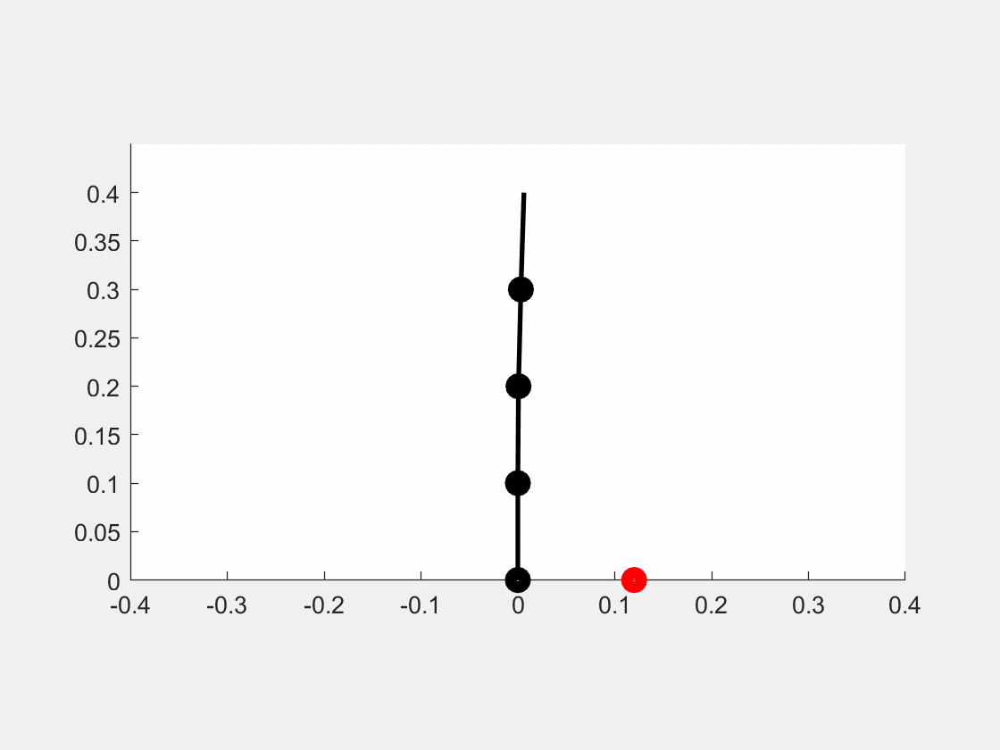 |  | 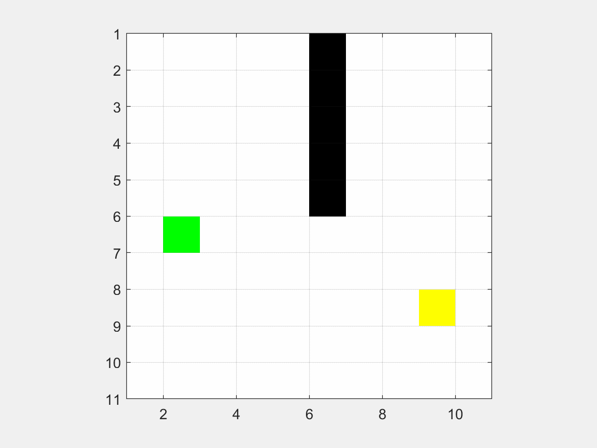
A* algorithm |InfoGAN | CGAN | LSGAN
 |  | | 
ACGAN|Value Iteration|Q-learning|sarsa
|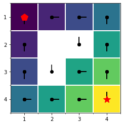|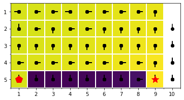|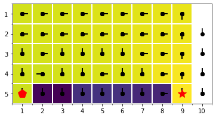
Potential Field Path|2D Homography |KLT Optical Track|3D Homography
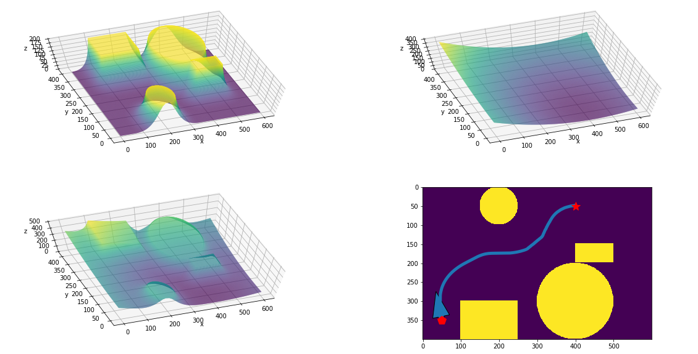|||
Point Cloud|Calibration|LDA|True Skill Ranking
|||
Gaussian Process|Attention Mechanism  (copy not originate from me)|Finite State Automata|Speech Synthesis
|||
PolyFit with Inverse|PolyFit with LU/Cholesky Factor|Bayesian Inference for Polynomial Regression|Solve ODE
|||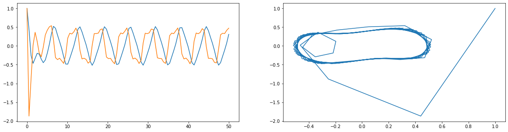
PD Track|Estimated Kalman Filter|Mobile Inverted Pendulum|LQR MIP
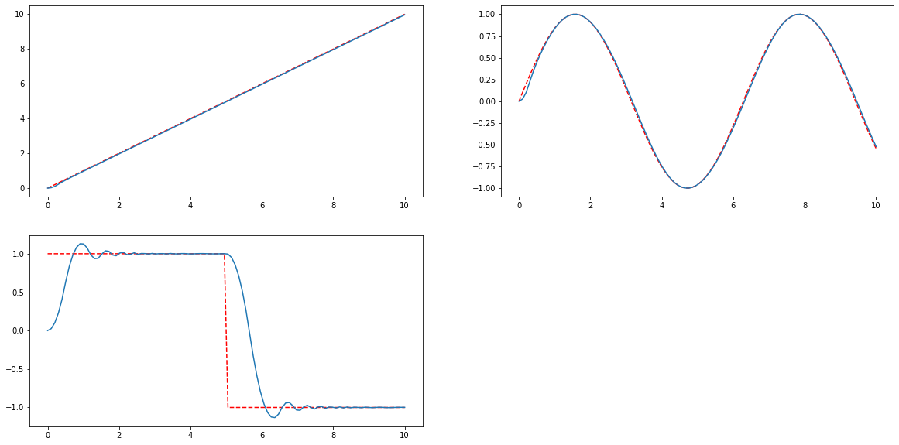||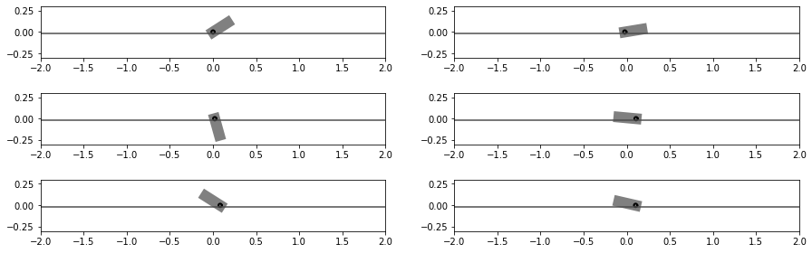|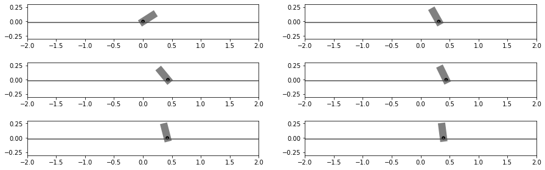
PID MIP|Configuration Space|Quadcopter 1D|Quadcopter 2D
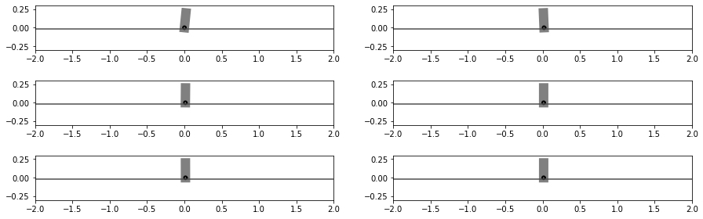|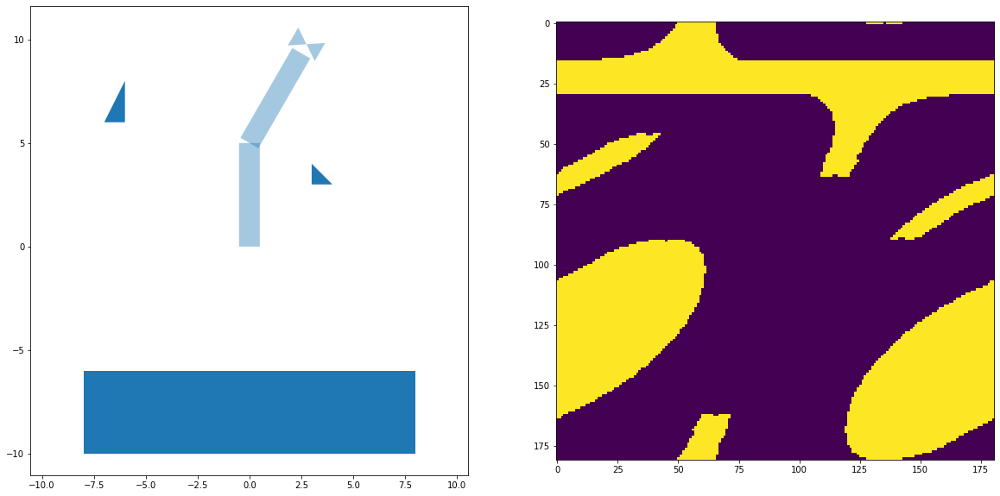||
Occupancy Grid Map|Particle Localization||
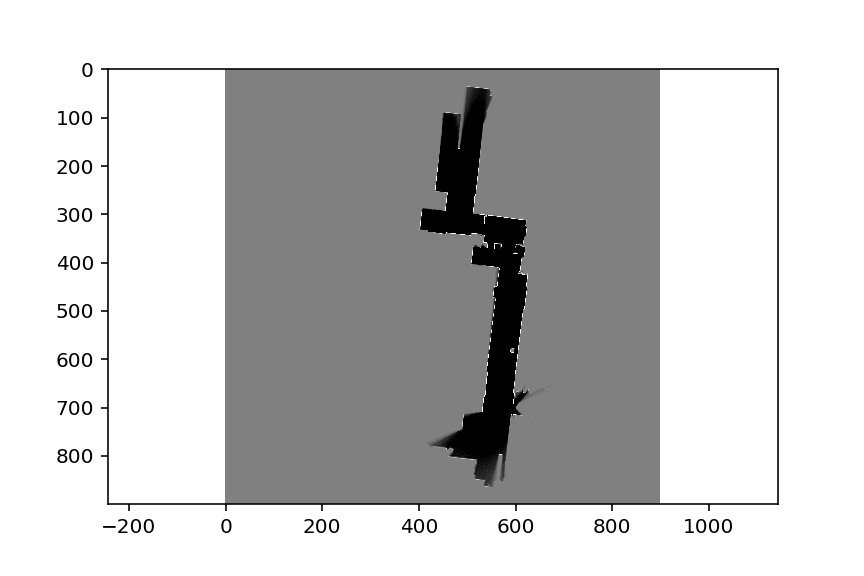|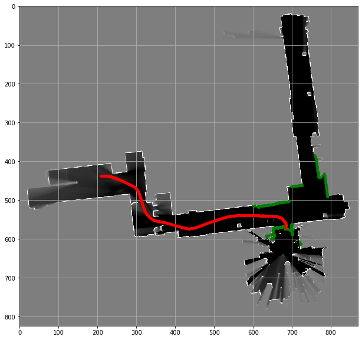||

